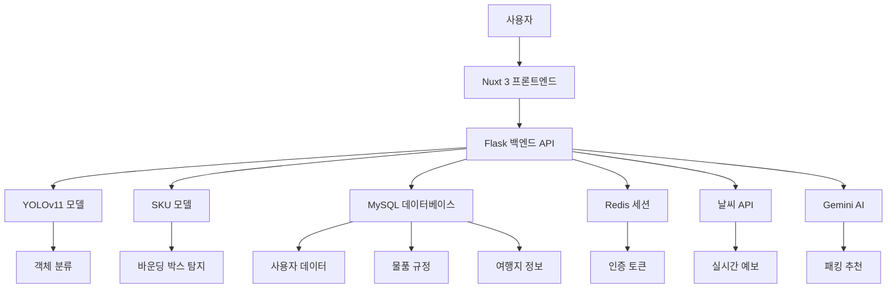

# 🎯 PassCheckers

> **AI 이미지 분석 기반 수하물 분류 및 여행 도우미 웹 애플리케이션**  
> 2025 캡스톤디자인 팀 프로젝트


---

## 📌 프로젝트 소개

**PassCheckers**는 사용자가 업로드한 수하물 이미지를 분석하여  
YOLOv11 기반 **커스텀 객체 탐지 모델**로 수하물 항목을 자동 인식하고,  
무게 추정, 패킹 추천, 다중 분류 기능 등을 제공하는 **웹 기반 여행 도우미 시스템**입니다.

---

## ✨ 주요 기능

### 🤖 AI 이미지 분석
- 📤 **이미지 업로드 및 YOLO 추론 요청**
- 🧠 **YOLOv11 기반 수하물 분류** (단일/다중 객체 탐지)
- 🎯 **SKU 모델 기반 바운딩 박스 탐지**
- ⚖️ **무게 추정** (클래스별 평균 무게 기반)
- 🏷️ **미탐지 항목 수동 태그 기능**

### 🧳 여행 도우미
- 🌍 **여행지별 맞춤 패킹 추천** (날씨 기반)
- 📅 **실시간 날씨 예보 연동** (14일 이내)
- 📊 **과거 날씨 데이터 분석** (14일 이후)
- 👥 **동반자별 맞춤 추천** (혼자/연인/가족/친구/아이와 함께)
- 🎨 **테마별 추천** (힐링/맛집/쇼핑/액티비티/문화)
- ✈️ **비행 조건별 추천** (장거리/단거리 비행)

### 👤 사용자 관리
- 🔐 **JWT 기반 인증 시스템**
- 📊 **분석 기록 저장 및 조회**
- 👤 **프로필 관리**
- 🔄 **실시간 세션 관리** (Redis)

---

## 📁 프로젝트 구조

```bash
PassCheckers/
├── frontend/                          # ✅ Nuxt 3 프론트엔드
│   ├── pages/                         # Vue 페이지 컴포넌트
│   │   ├── index.vue                  # 메인 페이지 (풀페이지)
│   │   ├── classification.vue         # 이미지 분류 페이지
│   │   ├── recommend.vue              # 여행 추천 페이지
│   │   ├── packing.vue                # 패킹 도우미 페이지
│   │   ├── profile.vue                # 사용자 프로필
│   │   ├── login.vue                  # 로그인 페이지
│   │   └── ...
│   ├── components/                    # Vue 컴포넌트
│   │   ├── classification/            # 분류 관련 컴포넌트
│   │   ├── packing/                   # 패킹 관련 컴포넌트
│   │   ├── recommend/                 # 추천 관련 컴포넌트
│   │   ├── profile/                   # 프로필 관련 컴포넌트
│   │   └── ...
│   ├── composables/                   # Vue 3 컴포저블
│   ├── middleware/                    # Nuxt 미들웨어
│   ├── layouts/                       # 레이아웃 템플릿
│   ├── assets/                        # 정적 자산
│   ├── public/                        # 공개 리소스
│   ├── server/                        # 서버사이드 렌더링
│   ├── app.vue                        # 메인 Vue 컴포넌트
│   ├── nuxt.config.ts                 # Nuxt 설정
│   ├── package.json                   # 프론트엔드 의존성
│   └── tsconfig.json                  # TypeScript 설정
│
├── backend/                           # ✅ Flask 백엔드 서버
│   ├── models/                        # 데이터 모델
│   │   ├── user.py                    # 사용자 모델
│   │   ├── item_model.py              # 아이템 모델
│   │   ├── detected_item_model.py     # 탐지된 아이템 모델
│   │   └── pytorch/                   # AI 모델 파일
│   │       ├── YOLOv11_model.pt       # YOLO 모델
│   │       └── SKU_model.pt           # SKU 모델
│   ├── repository/                    # DB 접근 계층
│   │   └── user_repo.py               # 사용자 데이터 접근
│   ├── service/                       # 서비스 로직
│   │   └── user_service.py            # 사용자 서비스
│   ├── services/                      # 외부 서비스
│   │   ├── amadeus_service.py         # 항공편 정보 API
│   │   ├── gemini_service.py          # Gemini AI 서비스
│   │   ├── weather_service.py         # 날씨 API 서비스
│   │   └── recommendation_service.py  # 추천 서비스
│   ├── routes/                        # API 라우트
│   │   ├── user.py                    # 사용자 관련 API
│   │   ├── classify.py                # 이미지 분류 API
│   │   ├── recommend.py               # 추천 API
│   │   ├── items.py                   # 아이템 관리 API
│   │   ├── analysis.py                # 분석 결과 API
│   │   ├── locations.py               # 여행지 정보 API
│   │   ├── flights.py                 # 항공편 정보 API
│   │   ├── packing.py                 # 패킹 관련 API
│   │   ├── weight.py                  # 무게 관련 API
│   │   ├── share.py                   # 공유 관련 API
│   │   ├── community.py               # 커뮤니티 API
│   │   └── category.py                # 카테고리 API
│   ├── matching/                      # 매칭 관련 모듈
│   │   ├── matcher.py                 # 매칭 로직
│   │   ├── item_service.py            # 아이템 서비스
│   │   └── recommend_matching_service.py # 추천 매칭
│   ├── sku/                           # SKU 관련 모듈
│   │   └── detect.py                  # SKU 탐지
│   ├── yolo/                          # YOLO 관련 모듈
│   │   └── detect.py                  # YOLO 탐지
│   ├── db/                            # 데이터베이스 유틸
│   │   └── database_utils.py          # DB 연결 및 유틸리티
│   ├── data_import/                   # 데이터 가져오기
│   │   ├── import_csv_to_mysql.py     # CSV → MySQL
│   │   ├── 1_locations.csv            # 여행지 데이터
│   │   ├── 2_budgets.csv              # 예산 데이터
│   │   ├── 3_cost_breakdowns.csv      # 비용 상세 데이터
│   │   ├── 4_location_content.csv     # 여행지 콘텐츠
│   │   ├── items_weight.csv           # 아이템 무게 데이터
│   │   ├── recommend/                 # 추천 관련 데이터
│   │   │   ├── airline_code.csv       # 항공사 코드
│   │   │   ├── location_details.csv   # 여행지 상세 정보
│   │   │   └── weather_data.csv       # 날씨 데이터
│   │   └── README.md                  # 데이터 가져오기 가이드
│   ├── static/                        # 정적 파일
│   │   └── thumbnails/                # 썸네일 이미지
│   ├── app.py                         # Flask 앱 메인 파일
│   ├── config.py                      # 환경 설정
│   ├── requirements.txt               # Python 패키지 목록
│   ├── env.example                    # 환경 변수 예시
│   └── README.md                      # 백엔드 문서
│
├── logs/                              # ✅ 로그 파일 (Git 무시)
│   ├── backend.log                    # 백엔드 로그
│   └── frontend.log                   # 프론트엔드 로그
│
├── README.md                          # ✅ 프로젝트 메인 문서
├── DEVELOPMENT.md                     # ✅ 개발 가이드
├── db_tables.md                       # ✅ 데이터베이스 스키마 문서
├── check_tables.sql                   # DB 테이블 확인 쿼리
└── package.json                       # 루트 패키지 설정
```

---

## 🧪 실행 방법

### 1️⃣ 프론트엔드 실행

#### 🔧 개발 모드 (권장)
개발 중 테스트 및 디버깅용으로 핫 리로드 기능 포함

```bash
cd frontend
npm install
npm run dev
```

- **자동 재시작**: 코드 수정 시 자동으로 새로고침
- **외부 접속**: 자동으로 `0.0.0.0:80`으로 실행되어 외부 접속 가능
- **디버깅**: 상세한 에러 메시지 및 경고 표시

#### 🚀 프로덕션 모드 (배포)
실제 서비스 배포 시 사용 (빌드 후 최적화된 파일 실행)

```bash
cd frontend

# 1. 프로덕션 빌드
npm run build

# 2. 프로덕션 서버 실행 (외부 접속 허용)
# Windows PowerShell
$env:HOST="0.0.0.0"
$env:PORT="80"
npm run start:prod

# Linux/Mac
HOST=0.0.0.0 PORT=80 npm run start:prod
```

- **최적화**: 코드 압축 및 최소화 (약 1/3~1/5 크기)
- **성능**: 더 빠른 로딩 속도
- **외부 접속**: 환경변수로 `0.0.0.0` 설정 시 외부 IP로 접속 가능

---

### 2️⃣ 백엔드 실행

#### 🔧 개발 모드 (권장)
개발 중 테스트 및 디버깅용

```bash
cd backend

# Windows
.venv\Scripts\activate

# Linux/Mac
source .venv/bin/activate

# 실행
python app.py
```

- **자동 재시작**: 코드 수정 시 자동으로 서버 재시작
- **디버그 모드**: 상세한 에러 트레이스 표시
- **포트**: http://0.0.0.0:5001

#### 🚀 프로덕션 모드 (배포)
실제 서비스 배포 시 사용 - 멀티 워커로 높은 성능 제공

```bash
cd backend

# Windows
.venv\Scripts\activate
pip install -r requirements.txt  # waitress 설치 확인

# Waitress 프로덕션 서버 실행
waitress-serve --host=0.0.0.0 --port=5001 app:app
```

**Linux/Mac의 경우 Gunicorn 사용 (더 높은 성능)**:
```bash
# Linux/Mac
source .venv/bin/activate
pip install -r requirements.txt  # gunicorn 설치 확인

# Gunicorn 실행 (워커 4개)
gunicorn -w 4 -b 0.0.0.0:5001 app:app
```

- **Waitress (Windows)**: 안정적인 WSGI 서버
- **Gunicorn (Linux/Mac)**: 멀티 워커로 동시 요청 처리
- **성능**: 개발 서버 대비 수백~수천 배 빠름
- **안정성**: 워커 크래시 시 자동 재시작

⚠️ **주의사항**:
- `requirements.txt`에 OS별 서버가 자동으로 설치됩니다
- `config.py`의 CORS 설정에서 실제 서버 IP를 적용하세요
- 프로덕션에서는 반드시 `DEBUG = False` 설정

---

### 3️⃣ Redis 확인

```bash
redis-cli
keys *
keys refresh_token:*
get refresh_token:1
```

---

### 4️⃣ MySQL 설정

```bash
(세부 설정은 추후 업데이트 예정)
```

---

## 🔧 기술 스택

|  분류   | 기술 |
|:--------:|:-----:|
| 프론트엔드 | Nuxt 3, Vue 3, TypeScript, Quasar UI |
| 백엔드 | Python 3.10, Flask 3.1 |
| 모델 | YOLOv11 (커스텀 학습) |
| 데이터베이스 | MySQL 8.0 |
| 인프라 | Nginx |
| 기타 | OpenCV, Numpy, Pillow, Redis, PyTorch, TensorRT |

---

## 🧭 시스템 아키텍처



---

## 📸 주요 화면

### 🏠 메인 페이지
- **풀페이지 디자인**으로 각 기능을 직관적으로 안내
- **반응형 UI**로 모든 디바이스에서 최적화된 경험

### 📸 이미지 분류
- **드래그 앤 드롭** 이미지 업로드
- **실시간 AI 분석** 결과 표시
- **바운딩 박스** 시각화 및 수정 가능
<p align="center">
  
</p>

### 🛄 수하물 패킹
- **드래그 앤 드롭**을 통하여 반입 여부 제공
- **반입 금지** 품목의 확실한 알림
- **플로팅 윈도우** 현재 패킹 상태의 요약된 윈도우
<p align="center">
  
</p>

### 📂 수하물 공유
- **공유 코드** 여행 동반자와 공유
- **통합 목록** 수하물 목록 제공
- **댓글 등록** 간단한 메모 가능
<p align="center">
  
</p>

### 📊 무게 예측
- **무게 예측**을 통해 예상 무게 제공
- **그래프** 예측된 무게 시각화
- **카테고리**화를 통해 개별 요소들 정리
<p align="center">
  
</p>

### 🧳 패킹 추천
- **설문 기반** 맞춤 추천
- **날씨 데이터** 연동
- **동반자/테마별** 개인화


### 👤 사용자 프로필
- **분석 기록** 관리
- **프로필 편집** 기능
- **계정 관리** 시스템

---

## 👥 팀원 소개

|  이름   | 역할 |
|:--------:|-----|
| 김민한 | 🧠 **YOLOv11 커스텀 모델 설계·학습**<br>· 학습 데이터셋 전처리 및 어노테이션 설계<br>· 하이퍼파라미터 튜닝 및 성능 최적화<br>· 프론트엔드 UI/UX 시안 설계 |
| 이상민 | ⚙️ **모델 고도화 및 알고리즘 개발**<br>· YOLOv11 다중 객체 분류 로직 구현<br>· 수하물 무게 예측 알고리즘 개발 (클래스별 평균 무게 기반)<br>· 패킹 추천 알고리즘 설계 |
| 이상호 | 💻 **풀스택 및 시스템 아키텍처 개발**<br>· Flask 기반 REST API 서버 구현<br>· Vue/Nuxt 프론트엔드 연동 및 상태관리<br>· Redis 세션 관리, MySQL DB 설계 및 쿼리 최적화<br>· 전체 시스템 설계 및 배포 환경 구성 |

---

## 🎯 프로젝트 완성 현황

### ✅ 완성된 기능들

#### 🤖 AI 모델 시스템
- **YOLOv11 커스텀 모델**: 수하물 객체 탐지 및 분류
- **SKU 모델**: 바운딩 박스 정확한 탐지
- **이중 모델 파이프라인**: SKU 탐지 → YOLO 분류
- **무게 예측 알고리즘**: 클래스별 평균 무게 기반

#### 🌍 여행 도우미 시스템
- **날씨 기반 추천**: 실시간 예보 + 과거 데이터
- **개인화 추천**: 동반자/테마/비행조건별 맞춤
- **여행지 데이터**: 20개 테이블로 구성된 종합 데이터베이스
- **Gemini AI 연동**: 지능형 패킹 추천

#### 💻 웹 애플리케이션
- **프론트엔드**: Nuxt 3 + Vue 3 + TypeScript
- **백엔드**: Flask + MySQL + Redis
- **인증 시스템**: JWT + Redis 세션 관리
- **API**: RESTful API 30+ 엔드포인트

#### 📊 데이터 관리
- **사용자 관리**: 회원가입/로그인/프로필
- **분석 기록**: 이미지 분석 결과 저장/조회
- **물품 규정**: 수하물 규정 데이터베이스
- **여행지 정보**: 위치/날씨/예산/콘텐츠 데이터

### 🚀 배포 준비 완료

- **프로덕션 서버**: Gunicorn/Waitress 지원
- **환경 설정**: 개발/프로덕션 분리
- **데이터베이스**: MySQL 스키마 완성
- **문서화**: API 문서 및 사용 가이드 완성

---

## 📝 개발 가이드

### 프로젝트 구조 개선 완료 ✅

1. **프론트엔드 분리**: ✅ 완료
2. **로그 파일 정리**: ✅ 완료  
3. **문서화 개선**: ✅ 완료
4. **백엔드 통합**: ✅ 완료

### 주의사항

- 프로젝트가 **완성 상태**로 모든 핵심 기능이 구현됨
- `backend/` 폴더에서 모든 백엔드 로직 관리
- `frontend/` 폴더에서 모든 프론트엔드 로직 관리 
